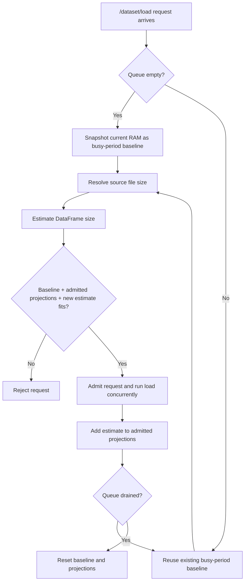

# Clinical Data Explorer Architecture

This document describes the architectural decisions in Clinical Data
Explorer.

## System Shape

Clinical Data Explorer runs as a Domino App or Extension with three main
services:

```text
Browser UI
  -> Flask backend
  -> MCP server
```

The browser UI is the single-page app in `chat_ui/`. The Flask backend is the
service created by `backend.app` and exposed through the top-level `app.py`
entrypoint. It serves the UI, manages the browser session, handles
Domino-facing work, and proxies analysis requests. The MCP server is the
service created by `mcp_server.app` and exposed through the top-level
`data_analysis_mcp.py` entrypoint. It owns loaded dataset state and performs
DataFrame-heavy operations such as filtering, summaries, and chart aggregation.

## Architectural Decisions

### Dataset State

When a user loads a dataset, the Flask backend arranges access to the file and the
MCP server reads it into an in-memory DataFrame.

Table and chart workflows then ask the MCP server for the specific
page, summary, filtered result, or chart aggregate they need. This avoids
sending dataset files to the browser. This also means that the memory on the pod is taken up
by datasets, so the app needs to have a large amount of memory resources and autoscaling may be helpful.

### Browser Sessions Have App Session IDs

The app creates a session ID for the user's browser session and stores it in the
app's signed session cookie. That ID is forwarded from the Flask backend to the
MCP server on analysis requests.

The session ID is the key that connects a browser session to:

- the dataset loaded for that browser session
- the user's analysis requests against that dataset
- the chat context for that browser session

The session ID is app-local. It is not a Domino user ID, and it is not intended
as a durable account identifier. This design choice does make it so that the app
doesn't work well with two browser tabs using two datasets at the same time.

### Domino APIs Are Used Only From The Backend

The browser does not call Domino APIs directly to avoid exposing secrets needed for auth.
The MCP server also does not own Domino API access. Domino-facing work is centralized in the Flask
backend.

The Flask backend uses Domino APIs when it needs to:

- list project datasets and dataset files
- browse or load dataset snapshots
- discover and read NetApp volume files
- resolve current-user information

### Authorization and Identity

When the app runs as a Domino Extension with identity propagation enabled, the viewing user's
Bearer token is used to authorize API calls to Domino. The user is not used to manage RBAC for anything
local to the app. The session ID is the closest thing to the user ID which is used for identifying state
that belongs to a user.

### Dataset Loads Are Queued

Dataset loading is expensive because it includes file downloading,
file download and conversion into a DataFrame.

For that reason, dataset load requests go through a bounded in-memory
admission queue before they enter the load path. When the first request in
a busy period arrives, the app snapshots current memory and uses that as
projected used RAM. Each additional admitted request increments projected
used RAM by its estimated loaded DataFrame size. The projection resets only
after the queue drains.

That tradeoff is acceptable today because DataFrame loading is the only
RAM-intensive operation this app currently performs. In the future, the app
should be refactored to avoid storing loaded DataFrames in process memory.
Busy periods are also expected to be short rather than lasting multiple
minutes. If long busy periods become common, this design should be revised
to refresh memory baselines more often.

This projection ignores live RAM usage changes after the first request in a
busy period is admitted. The queue does not refresh the baseline for every
request because earlier requests may be partially downloaded when later
requests arrive. A fresh live snapshot would include that memory increase
while the queue also counts the same request's projected DataFrame size,
artificially inflating projected RAM and rejecting more load requests than
necessary.



properties of the queue:

- it protects memory and download pressure inside a pod
- it gives users a clear capacity error when the process is already saturated
- it is not a durable job queue
- it is not shared across app pods or independent worker processes

### Caches Are Process-Local

The app uses several in-memory caches:

- loaded DataFrames in the MCP server, to provide a database-like experience
- browser-session metadata that maps session IDs to loaded datasets with a last used base expiration
- temporary downloaded file metadata used for cleanup after loading a file
- chat message history per session
- small browser-side UI caches for file browsing and summary stats

These caches are not shared between separate backend processes, MCP server processes, or app pods.

That decision has operational consequences:

- production app worker count should be `1` until state is moved to shared storage
- we rely on sticky sessions when autoscaling is turned on, so that state for each user stays on a single pod
- cache and session limits must be sized for expected concurrent usage

## Dataset Load Flow

At a high level, loading a dataset works like this:

```text
Browser
  asks to load a dataset

Flask backend
  attaches the browser session ID
  queues the load request
  resolves the file source
  uses Domino APIs if the file is Domino-backed
  downloads or locates the file
  sends the file path to the MCP server

MCP server
  reads the file into a DataFrame
  caches the DataFrame
  maps the browser session ID to the loaded dataset

Flask backend
  clears chat history for that browser session after the load succeeds
  returns dataset metadata to the UI

Browser
  initializes table, charts, and filters
```

The load path supports Domino datasets, dataset snapshots, dataset
file deeplinks, NetApp volumes, and NetApp volume files. Snapshot identity is preserved where
possible so the app can reload the exact file revision the user chose.

Chat history is cleared only for the browser session that loaded the dataset,
and only after the MCP server has successfully loaded the new file. A failed
dataset load should leave the existing chat context alone. The reset matters
because chat history is tied to the previously loaded dataset: if a user switches
from one dataset to another, old questions, answers, and tool results can refer
to columns, values, or filters that no longer apply. Clearing the
session's chat history makes the next chat start from the newly loaded dataset
instead of carrying assumptions from the old one.

## Analysis Flow

After a dataset is loaded, most user interactions follow the same pattern:

```text
Browser
  sends table, filter, chart, summary, or chat request

Flask backend
  forwards the request to the MCP server with the browser session ID

MCP server
  finds the DataFrame for that session
  performs the requested operation
  returns the result

Browser
  renders the page, chart, summary, or chat response
```

## Permalinks And Deep Links

The app stores view state in URLs so users can share or return to a specific
view.

## Operational Notes

The current design favors a simple, self-contained app pod over a distributed
state architecture. That is appropriate for the app's current shape, but it
means capacity planning matters.

Important operational assumptions:

- keep Flask backend and MCP server worker counts equal to `1`, which is aligned with the process-local
  state model
- size memory for loaded DataFrames, not just raw source files. DataFrames may be ~5x bigger than source
- configure dataset size limits according to the hardware tier
- treat queues and caches as per-process safeguards, not global coordination
- sticky routing is required for horizontally scaled deployments. This is the default behavior with Domino
  App autoscaling

If the app needs higher scale later, the main architectural change would be to
externalize shared state: the dataset load queue, DataFrame caching, chat history. Some concurrency
safeguards may be removed at that time.
