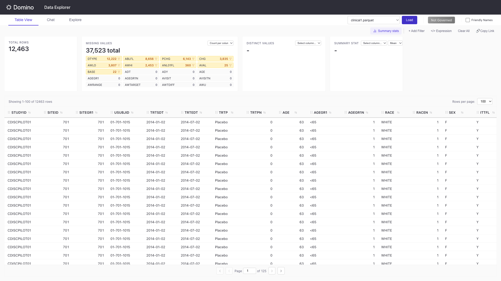
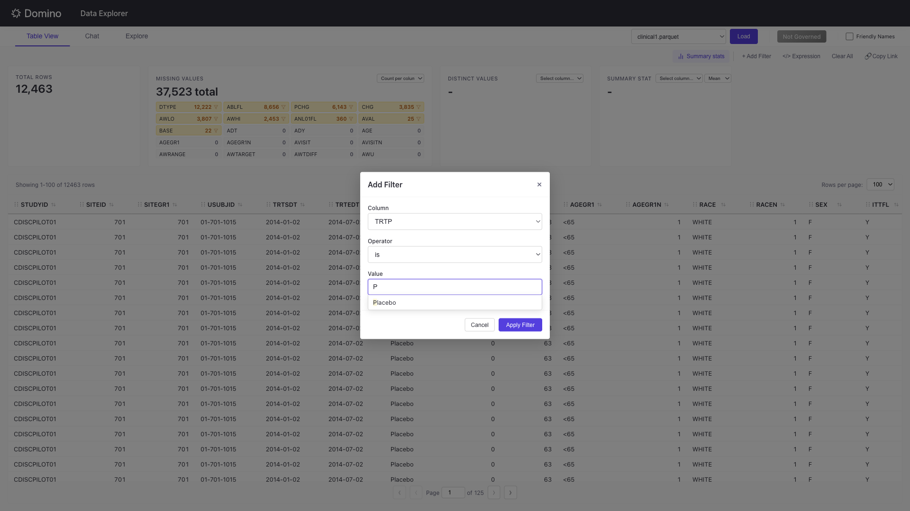
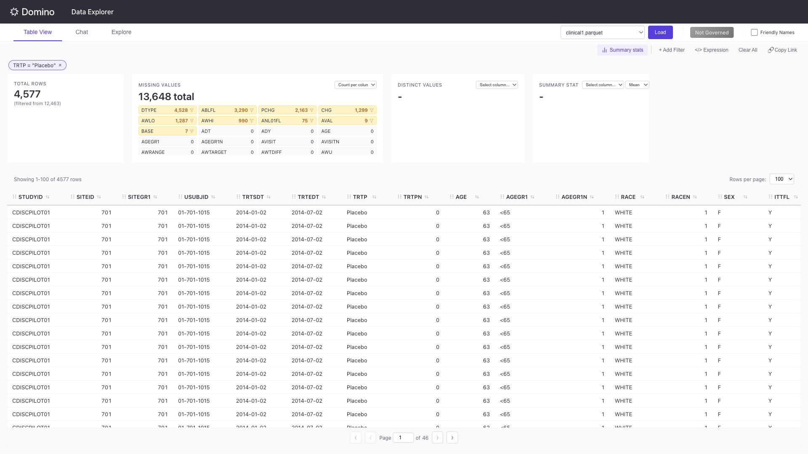
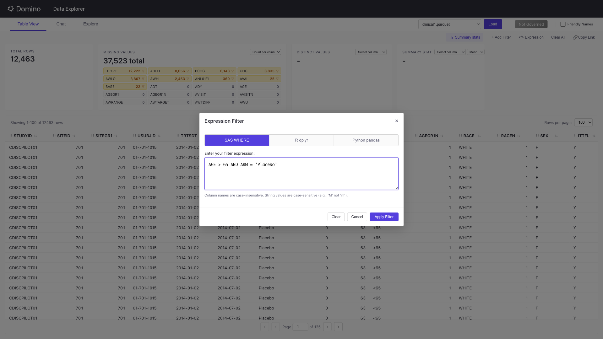
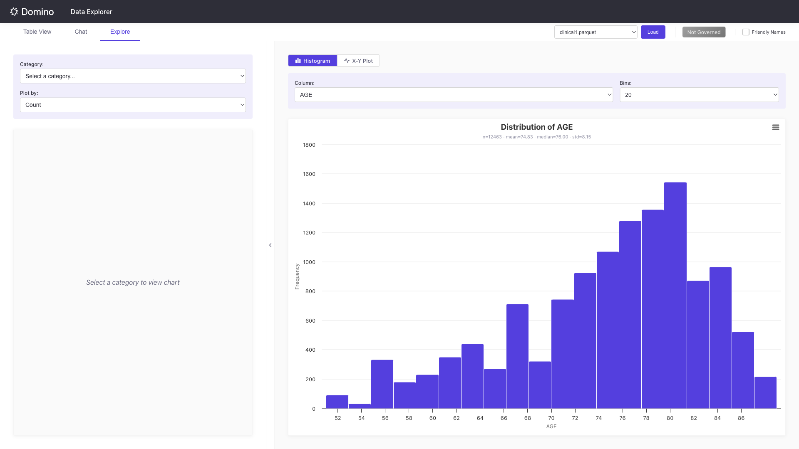
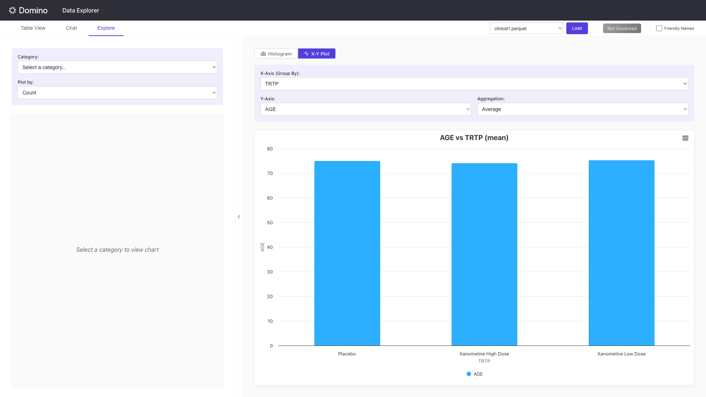
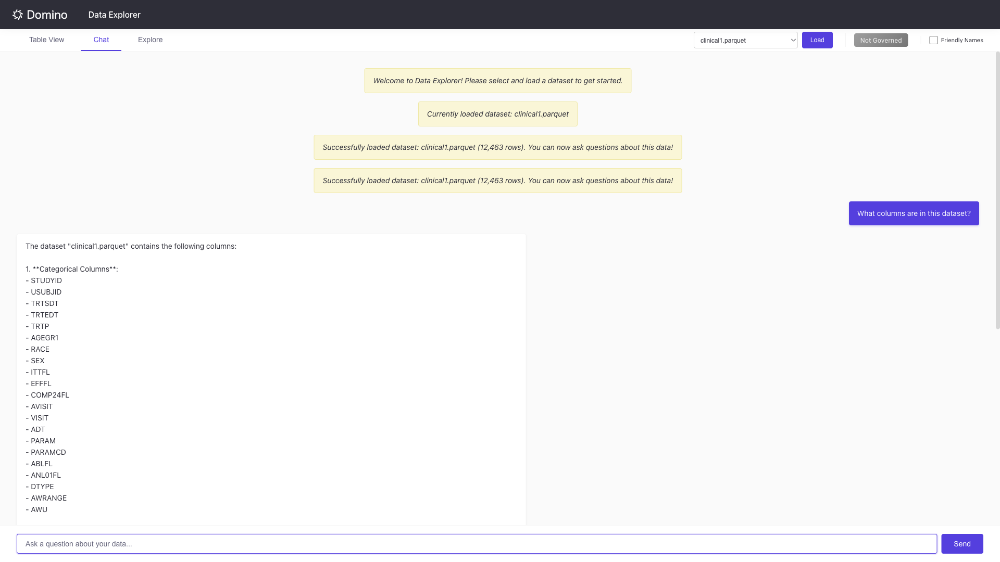
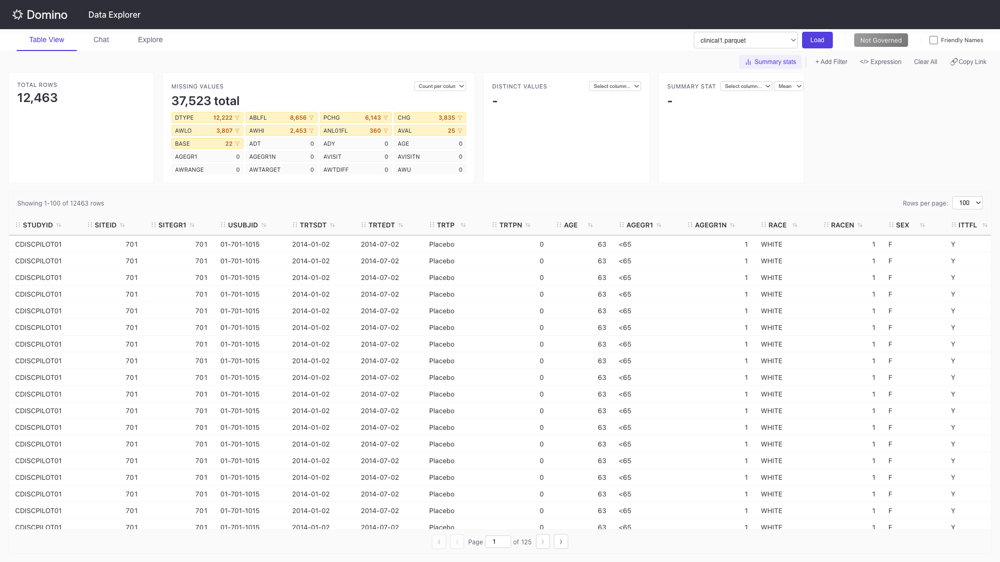
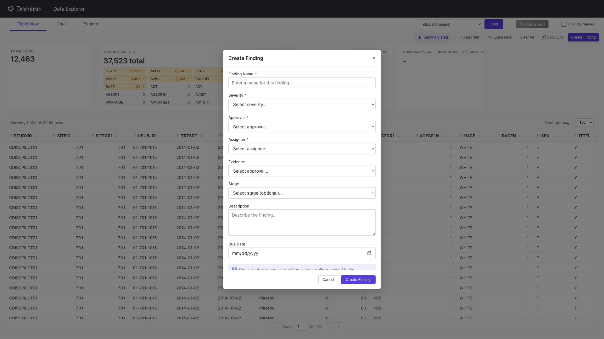

# Data Explorer

Data Explorer is an AI-powered dataset analysis application that helps you explore, filter, and visualize data through an intuitive web interface. It supports natural language queries and provides interactive visualizations for clinical and general datasets.

## Overview

Data Explorer provides three main capabilities:

- **Table View**: Browse and filter datasets with an interactive data table
- **Explore**: Create visualizations with configurable charts
- **Chat**: Ask questions about your data using natural language (requires LLM configuration)

## Deploy as a Domino App

### Prerequisites

Data Explorer is designed to run as a Domino App. Dependencies are managed with `uv` via `pyproject.toml` and `uv.lock`.

**required tools**
- uv

### Development Quick-Start

- Some dataset related features require that the app runs in a Domino execution. To develop in a workspace, create a git based project with this repo, in the central config dashboard, set `com.cerebro.domino.workbench.workspace.sandboxForwardedPortsInVsCode=false`, then launch a vscode workspace, set `MAIN_APP_PORT=8000`, and follow the next instructions to install and run the app. Then open the vscode proxied port for the flask app
- Rename the `.env-example` to `.env` and fill in the environment variables
- Install and run the app:
```sh
uv sync --locked
./start_servers.sh
```

### App Configuration

1. Navigate to your Domino project and select **Publish > App**
2. Set the startup script to:
   ```
   start_servers.sh
   ```
3. **Important**: Enable **"Deep linking and query parameters"** in the app settings to support shareable filter URLs

### Data Access

Data Explorer reads data files from the `datasets` folder in your Domino project. Supported formats include:

- CSV (`.csv`)
- Parquet (`.parquet`)
- SAS (`.sas7bdat`)
- SAS Transport (`.xpt`)

Add your data files to the project's `datasets` folder, and they will appear in the dataset dropdown when the app loads.

> **Note**: The app runs with the permissions of the user who deployed it (the app owner), not the visiting user. All visitors will have the same read access to datasets as the owner. This behavior will be improved in a future release.

### Column Labels (Friendly Names)

Data Explorer supports human-readable labels for column names, useful for datasets with cryptic variable names (e.g., CDISC/ADaM clinical data). When enabled, column headers and dropdowns display friendly labels instead of raw column names.

#### Enable Friendly Names in the UI

Toggle the **Friendly Names** checkbox in the header bar to switch between raw column names and human-readable labels.

#### Configure the Labels File

Create a file named `column_labels_simple.csv` in your project root with two columns:

```csv
column_name,label
AGE,Age
ARM,Description of Planned Arm
BMIBL,Baseline BMI (kg/m^2)
USUBJID,Unique Subject Identifier
```

The app automatically loads this file on startup. If the file doesn't exist, the Friendly Names toggle will have no effect.

#### Example Labels File

The project includes a sample `column_labels_simple.csv` with CDISC ADaM variable mappings:

| column_name | label |
|-------------|-------|
| AGE | Age |
| AGEGR1 | Pooled Age Group 1 |
| ARM | Description of Planned Arm |
| BMIBL | Baseline BMI (kg/m^2) |
| USUBJID | Unique Subject Identifier |
| TRT01P | Planned Treatment for Period 01 |

You can modify this file to add labels for your own datasets. The mappings apply across all loaded datasets—any column matching a `column_name` entry will display the corresponding label.

### Environment Variables

Configure the following environment variables in your Domino project settings:

#### Required for Governance Features

| Variable | Description |
|----------|-------------|
| `DOMINO_API_HOST_OVERD` | Your Domino deployment URL (e.g., `https://your-domino-deployment.com`). This overrides the auto-detected `DOMINO_API_HOST` when set. |

#### Optional: AI Chat Feature

To enable the natural language chat feature, configure an LLM provider:

| Variable | Description |
|----------|-------------|
| `LLM_API_KEY` | API key for your LLM provider (not required for local Ollama) |
| `LLM_BASE_URL` | Base URL for OpenAI-compatible API (default: `https://api.openai.com/v1`) |
| `LLM_MODEL` | Model name to use (default: `gpt-4o-mini`) |

**Example configurations:**

- **OpenAI**: Set `LLM_API_KEY=sk-xxx` and optionally `LLM_MODEL=gpt-4o`
- **Local Ollama**: Set `LLM_BASE_URL=http://localhost:11434/v1` and `LLM_MODEL=llama3`
- **Azure OpenAI**: Set `LLM_BASE_URL=https://your-resource.openai.azure.com/openai/deployments/your-deployment` and `LLM_API_KEY`
- **Together AI**: Set `LLM_BASE_URL=https://api.together.xyz/v1`, `LLM_API_KEY`, and `LLM_MODEL=meta-llama/Llama-3-70b-chat-hf`

## Use the Table View

The Table View provides an interactive data table for browsing and filtering your datasets.

### Load a Dataset

1. Select a dataset from the **Dataset** dropdown in the header
2. Click **Load** to load the data


The interface displays:
- **Total Rows**: Number of rows in the dataset (updates when filtered)
- **Missing Values**: Percentage or count of missing data
- **Distinct Values**: Unique value count for selected columns
- **Summary Stat**: Aggregated statistics for numeric columns

### Analyze Missing Values

The Missing Values panel provides a detailed breakdown of null or missing data across all columns:



1. View the **total count** of missing values across all columns
2. See **per-column badges** showing which fields have missing data and how many
3. **Click any column badge** to instantly filter the table to show only rows where that column is missing
4. Applied missing value filters appear as filter badges (e.g., "Analysis Value is missing")

This feature helps you quickly identify data quality issues and investigate specific missing values in your dataset.

### Add Filters

Use the filter system to narrow down your data:

1. Click **+ Add Filter**
2. Select a column from the dropdown
3. Choose an operator (is, is not, contains, greater than, between, etc.)
4. Enter the filter value - autocomplete suggestions appear based on column values
5. Click **Apply Filter**



Applied filters appear as badges below the Filters header. The table updates to show only matching rows:



### Expression Filters

For complex filtering logic, use the Expression Filter:

1. Click **</> Expression**
2. Choose your preferred syntax: **SAS WHERE**, **R dplyr**, or **Python pandas**
3. Enter your filter expression
4. Click **Apply Filter**



Example expressions (SAS WHERE syntax):
```
AGE > 65 AND ARM = 'Placebo'
COLUMN IN ('val1', 'val2')
COLUMN IS NOT MISSING
```

### Share Filtered Views

Click **Copy Link** to copy a URL that preserves your current filters. Share this link with colleagues to give them the same filtered view of the data.

## Use the Explore Tab

The Explore tab provides interactive visualizations for your data with two distinct modes: **Histogram** and **X-Y Plot**. Switch between them using the toggle tabs at the top of the chart area. On the left sidebar, you can also select a **Category** column and **Plot by** metric to view a category-level bar chart alongside the main chart.

### Create a Histogram

Use the Histogram mode to visualize the distribution of a single column:

1. Navigate to the **Explore** tab
2. Click the **Histogram** tab (bar chart icon) if not already selected
3. Select a column from the **Column** dropdown (e.g., AGE)
4. Choose the number of **Bins** (10, 20, 30, 50, or 100) to control the granularity of the distribution

The chart displays a histogram with summary statistics (n, mean, median, std) shown below the title.



### Create an X-Y Plot

Use the X-Y Plot mode to visualize relationships between two columns with aggregation:

1. Click the **X-Y Plot** tab (line chart icon)
2. Select a column for **X-Axis (Group By)** (e.g., a treatment arm like TRTP)
3. Select a numeric column for **Y-Axis** (e.g., AGE)
4. Choose an **Aggregation** method (Average, Sum, Count, Min, Max)

The chart plots the aggregated Y values for each group on the X axis, making it easy to compare metrics across categories.



## Use the Chat Feature

When configured with an LLM provider, the Chat tab enables natural language queries about your data. The AI assistant can answer questions about your dataset structure, compute statistics, and generate visualizations directly in the conversation.

### Example: Asking About Your Data

Ask the chatbot about the columns in your dataset or request specific analyses:



### Example Queries

- "What columns are in this dataset?"
- "Show me statistics for all numeric features"
- "What's the distribution of AGE?"
- "Compare BMI and Age"
- "What are the value counts for ARM?"
- "Show me a correlation matrix for numeric columns"

## Use Domino Governance

Data Explorer integrates with Domino Governance to help you create findings for governed datasets. When a dataset is attached to a governance bundle, you can submit findings directly from the app.

### Governed Datasets

When you load a dataset that's part of a Domino governance bundle, a green **Governed** badge appears in the header. This indicates the file is being tracked for compliance and audit purposes.



The **Create Finding** button appears when a governed dataset is loaded. For non-governed files, a gray "Not Governed" badge appears instead and the Create Finding button is hidden.

### Create a Finding

To submit a finding for a governed dataset:

1. Load a governed dataset (the **Governed** badge should appear)
2. Optionally apply filters to focus on specific data issues
3. Click **Create Finding**
4. Fill in the required fields:
   - **Finding Name**: A descriptive name for the issue
   - **Severity**: Critical, High, Medium, Low, or Informational
   - **Approver**: Select from designated approvers for the bundle
   - **Assignee**: Who should address the finding
5. Optionally add:
   - **Evidence/Approval**: Link to a specific approval workflow
   - **Stage**: The governance stage (e.g., Self QC, Double Programming)
   - **Description**: Details about the finding
   - **Due Date**: When the finding should be resolved



When you submit a finding, the current data view URL (including any active filters) is automatically appended to the description. This creates a permalink that allows reviewers to see exactly what data you were viewing when you identified the issue.

### Requirements

Governance features require:
- `DOMINO_API_HOST_OVERD` environment variable set to your Domino deployment URL
- The dataset file must be attached to an active governance bundle in Domino
- Appropriate permissions to create findings in the bundle

## Troubleshooting

### "No datasets found"

- Verify that data files exist in the `datasets` folder
- Check that files have supported extensions (`.csv`, `.parquet`, `.sas7bdat`, `.xpt`)

### Chat feature shows "Not Configured"

- Ensure LLM environment variables are set in your Domino project
- For cloud providers, verify your `LLM_API_KEY` is valid
- For local Ollama, confirm the service is running and `LLM_BASE_URL` is correct

### Governance features unavailable

- Set `DOMINO_API_HOST_OVERD` to your Domino deployment URL
- Verify your API credentials have appropriate permissions

### Filters not persisting

- Ensure "Deep linking and query parameters" is enabled in your Domino App settings

## Testing

Run `make test` before committing. Run `make test-all` before opening a PR.

- `make test` — MCP contract tests (FastAPI `TestClient`, no servers needed, ~3s)
- `make test-e2e` — Playwright smoke test that walks the whole app (~60–90s)
- `make test-all` — both layers
- `make test-external` — tests that hit real external services (governance, chat). Run these before shipping a change that touches governance or chat.

First-time setup:

```
uv sync --locked
uv run --locked playwright install chromium     # only needed for make test-e2e
```

### When you add a feature

- Add one step to `tests/e2e/test_smoke.py` that exercises the UI path. This is the primary safety net.
- Only add an MCP contract test if the feature introduces a new *category* of backend behavior (not a new endpoint within an existing category).
- Do NOT add unit tests for internal helpers; prefer integration-level tests.
- If the feature depends on governance, chat, or another external service, mark the test `@pytest.mark.external`.

# To Do
auth passthrough for Domino extensions mode
